# DSAP

DSAP (Demographic Similarity from Auxiliary Profiles) is a two-step methodology for comparing the demographic composition of two datasets. DSAP can be deployed in three key applications: to detect and characterize demographic blind spots and bias issues across datasets, to measure dataset demographic bias in single datasets, and to measure dataset demographic shift in deployment scenarios. An essential feature of DSAP is its ability to robustly analyze datasets without explicit demographic labels, offering simplicity and interpretability for a wide range of situations.

The usage of DSAP is shown in [howto.ipynb](howto.ipynb).